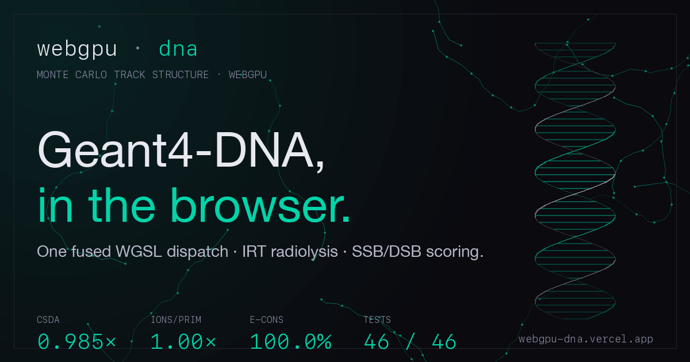

# WebGPU Geant4-DNA

[](https://github.com/abgnydn/webgpu-dna/actions/workflows/ci.yml)
[](./LICENSE)
[](https://webgpudna.com)
[](./validation/compare.py)
[](./tests)

A WebGPU port of [Geant4-DNA](https://geant4-dna.in2p3.fr/) — the CNRS/IN2P3-coordinated Monte Carlo track-structure toolkit for radiobiology — running entirely in the browser.

One GPU thread per primary electron, full particle history in a single fused compute dispatch, Karamitros 2011 Independent-Reaction-Time chemistry in a Web Worker, and SSB/DSB scoring on a 21×21 B-DNA fiber grid at 10 keV.

<p align="center">
  <a href="https://webgpudna.com">
    
  </a>
</p>

## Results (N = 4096 primaries @ 10 keV)

| Metric                     | This build | Reference                   | Ratio      |
| -------------------------- | ---------- | --------------------------- | ---------- |
| CSDA range (nm)            | 2714.4     | 2756.5 (Geant4-DNA direct)  | **0.985×** |
| Energy conservation        | 100.0 %    | 100.0 %                     | 1.000×     |
| Ions per primary (full)    | ≈ 509      | 509.1 (Geant4 direct)       | 1.00×      |
| G(OH) at 1 μs              | 1.55       | 2.50 (Karamitros 2011)      | 0.62×¹     |
| G(e⁻aq) at 1 μs            | 1.41       | 2.50                        | 0.56×¹     |
| G(H) at 1 μs               | 0.71       | 0.57                        | 1.24×      |
| G(H₂O₂) at 1 μs            | 0.60       | 0.73                        | 0.83×      |
| G(H₂) at 1 μs              | 0.47       | 0.42                        | 1.11×      |

¹ G(OH) / G(e⁻aq) at 10 keV LET are inherently below the Karamitros 2011 low-LET (~1 MeV) reference — track-core density drives higher radical recombination.

46 unit tests pass across 7 files. See `validation/compare.py` for the full side-by-side against a Geant4-DNA ntuple.

### Research-grade validation ledger

12 falsifiable experiments shipped as committed JSON artifacts under [`experiments/results/`](./experiments/results/). See [RESEARCH.md](./RESEARCH.md) for the protocol; per-experiment specs under [`experiments/level-N-*/protocol.md`](./experiments/).

| Level | ID | Status | Headline |
|------:|:---|:-------|:---------|
| 0 | B0, B1 | ✓ | Browser-runner infrastructure: Playwright + headless Chromium WebGPU; B1 drives the live harness end-to-end (E=100 eV, CSDA=15.7 nm in 4.4s) |
| 1 | E1–E4b | ✓ | All four cross-section families bit-matched against G4EMLOW source data (5 experiments) |
| 2 | E5    | ✓ | CSDA + E-cons + ions @ 10 keV vs Geant4 ntuple — surfaces 0.985× as **4.61σ statistically significant** |
| 2 | E6    | ✓ | MFP across 6 energy bins — confirms "MFP within 2-14%" prose as -3.5% to -10.5% across [100 eV, 10 keV] |
| 2 | E6b   | ✓ | Per-process σ decomposition — surfaces **σ_ion 5.6% high and σ_el 6.3% high** vs Geant4 (previously undocumented) |
| 4 | E10   | ✓ | IRT G-values vs Karamitros 2011 across 5 primary energies — surfaces **G(eaq) V-shape at 1-3 keV** (~40σ outside MC noise — track-end physics) |

Run any experiment via `npm run experiments -- <id>` (e.g. `E1`, `E10`, `B1`).

## Quick start

```bash
npm install
npm run dev            # http://localhost:8765
npm run test           # 46 tests, ~200 ms
npm run lint
npm run build          # dist/
```

Requires a WebGPU-capable browser. Shipped on-by-default in Chrome / Edge 113+ desktop, Chrome 121+ Android (Android 12+ on Qualcomm / ARM GPUs), Safari 26+ (macOS Tahoe, iOS / iPadOS / visionOS 26, Sep 2025), Firefox 141+ on Windows, and Firefox 145+ on macOS 26 Tahoe (Apple Silicon only). Firefox Linux, Firefox Android, and older Firefox still need `dom.webgpu.enabled` in `about:config`. Full matrix: [caniuse.com/webgpu](https://caniuse.com/webgpu).

## Project layout

```
src/
├── shaders/       WGSL compute shaders (helpers, primary, secondary, chemistry)
├── physics/       Constants, types, DNA geometry, cross-section loader
├── gpu/           Device init, buffers, pipelines, Phase A/B/C dispatch
├── chemistry/     IRT worker wiring, GPU chemistry schedule, reactions
├── scoring/       SSB/DSB scoring, ESTAR reference, dose projections
├── ui/            Results table, canvas dose projections
├── app.ts         runValidation orchestrator
└── main.ts        entry point

tests/unit/        Vitest unit tests (46 across 7 files)
tests/fixtures/    Geant4-DNA reference numbers (JSON)
public/            Generated cross_sections.wgsl, irt-worker.js, monolithic reference HTML
tools/             Python + Node helpers (G4EMLOW converter, IRT driver)
validation/        Geant4-DNA comparison harness (compare.py, analyze_g4.py)
```

Deep-dive: [`ARCHITECTURE.md`](./ARCHITECTURE.md). Physics provenance and validation history: [`CLAUDE.md`](./CLAUDE.md).

## Regenerating cross sections

The committed `public/cross_sections.wgsl` (1.3 MB) is generated from the G4EMLOW reference data (245 MB, not committed). To rebuild:

```bash
# Download G4EMLOW from https://geant4-data.web.cern.ch/datasets/
# (current: G4EMLOW.8.8.tar.gz, shipped with Geant4 11.4.1). Extract so that
# data/g4emlow/dna/ exists, then:
npm run convert
```

## What's implemented

- **Physics:** Born ionization (5 shells, data-driven CDF sampling), Emfietzoglou excitation (5 levels, dissociative branching 0.65 / 0.55 / 0.80), Champion tabulated elastic angular CDF (< 200 eV), screened-Rutherford elastic (> 200 eV), Sanche 9-mode vibrational (2–100 eV), full primary-momentum conservation.
- **Chemistry:** Karamitros 2011 9-reaction IRT in a Web Worker (Smoluchowski TDC + Onsager-screened PDC for charged pairs, G4EmDNAChemistry_option1). 2.0 nm mother displacement, species-specific product displacement, e⁻aq thermalization at 1.7 eV, H₂O₂ / OH⁻ tracked as reactive products with full re-pairing.
- **DNA scoring:** Event-level direct SSB from `rad_buf` ionization sites, indirect SSB from diffused OH at 1 μs, greedy ±10 bp DSB clustering, kernel-level backbone hit counter as a cross-check.
- **Grid target:** 21×21 parallel B-DNA fibers × 3 μm × 150 nm spacing = 3.89 Mbp.

## Known gaps

- GPU-resident chemistry path (`chemBackend: 'gpu'`) undercounts long-time reactions vs IRT because the spatial hash search radius is narrower than the diffusion σ at 30 ns timesteps. Default backend is therefore the IRT worker.
- `data/g4emlow/` is not committed — download from CERN (link above) to rebuild cross sections.

## License

MIT for the simulation code. The Geant4-DNA cross-section data is distributed under the [Geant4 Software License](https://geant4.web.cern.ch/license/LICENSE.html) (BSD-like).
